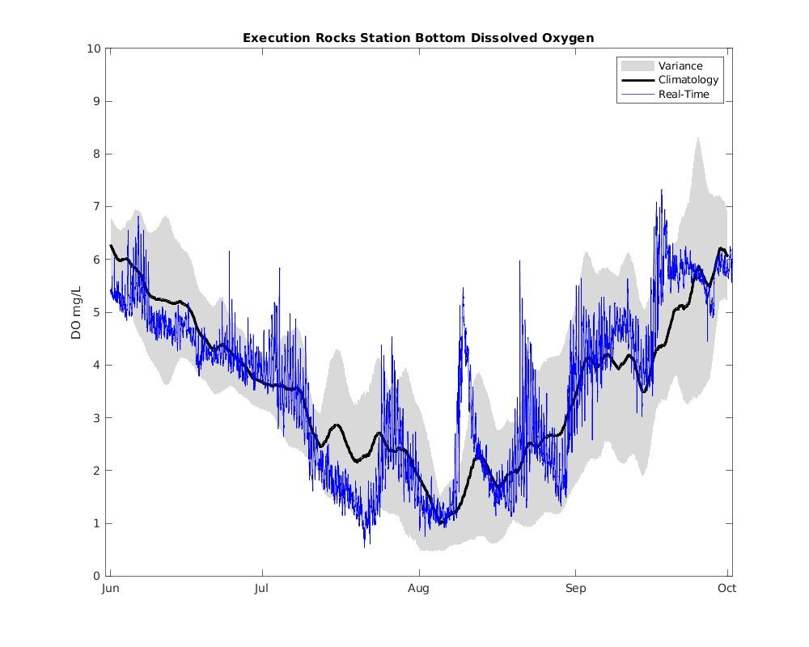

```{r setup, include=FALSE}
##install.packages("rmdformats")
library(rmdformats)
knitr::opts_chunk$set(echo = FALSE, warning = FALSE, message = FALSE)
```
```{r, echo=FALSE, out.width="150%"}
   

options(repos = list(CRAN = "http://cran/rstudio.com/"))

```


 
<hr>
## **Background** 
<hr>
Hypoxia is a condition in which of low or depleted dissolved oxygen concentrations are observed in the waters of Long Island Sound (LIS).  Hypoxia impacts up to half of the LIS waters each summer. The primary cause of hypoxia is excess nitrogen from human sources. These sources include sewage treatment plant discharges, storm water runoff and atmospheric deposition.

Dissolved oxygen (DO) levels below 3.0 mg/L are considered hypoxic in LIS.  Hypoxic conditions cause impairment and in some cases death to aquatic life. Some studies have found DO can become limiting below 4.8 mg/L for sensitive fish species while more tolerant species are not affected until DO falls below 2.0 mg/L (Simpson et al. 1995, 1996).  

Since 1991, the [Connecticut Department of Energy and Environmental Protection (CT DEEP)](https://portal.ct.gov/DEEP/Water/LIS-Monitoring/LIS-Water-Quality-and-Hypoxia-Monitoring-Program-Overview) and the [Interstate Environmental Commission (IEC)](https://www.iec-nynjct.org/programs/water/sound-monitoring) have conducted an intensive water quality monitoring program on LIS. The program is funded through a grant from the U.S. Environmental Protection Agency's (EPA) [Long Island Sound Study (LISS)](https://longislandsoundstudy.net/). In 2003, the [Long Island Sound Integrated Coastal Observing System (LISICOS)](https://lisicos.uconn.edu/index.php) consisting of a series of buoys equipped with continuous water quality, current, and meteorological monitoring sensors was deployed across LIS to increase the temporal resolution of collected data. Data from the surveys are used to quantify and identify annual trends and differences in water quality parameters relevant to hypoxia, in particular nutrients, temperature, and chlorophyll. These data are also used to evaluate the effectiveness of the LIS management programs' efforts to reduce anthropogenic nitrogen inputs.  Nitrogen is a primary contributor to the excessive algae growth that leads to hypoxia in LIS. 

During the summer (June - September), surveys across LIS (Figure 1) are conducted at bi-weekly intervals to better define the areal extent and duration of hypoxia. During these surveys stations are sampled for in-situ parameters including dissolved oxygen, temperature, pH, and salinity. 

```{r, fig.cap = '<i> Interactive map of LIS survey stations.  Click on each station to find information on sampling index period for that station. UCONN LISICOS Buoy Stations in Norwalk Harbor, Thames River, and the Eastern Sound have been discontinued. </i>'}
##install.packages("sf")
##install.packages ("geojsonio")
##install.packages ("htmltools")
##install.packages("htmlwidgets")
##install.packages("stringi")
##install.packages(c("sp", "raster"))

library(leaflet)
library(readxl)


RefPts <- read_excel("data/ReferencePoints2.xlsx")

RefPts$color <- ifelse(RefPts$StationType == "CTDEEP", "blue", 
                ifelse(RefPts$StationType == "UCONN", "yellow", "salmon"))
  
  
mRefPts <-leaflet() %>% 
  addProviderTiles(providers$CartoDB.PositronNoLabels) %>% 
  setView(lng = -72.799, lat = 41.126, zoom = 9) %>%   
  addCircleMarkers(data=RefPts,  
                  lng= ~Longitude,
                  lat= ~Latitude, 
                  radius = 2,
                  color = ~color, 
                  popup=~paste(RefPts$StationType, "<br> Station_Name:", RefPts$Station_Name,
                            "<br>Depth:", RefPts$Approximate_Depth,
                            "<br>Schedule:", RefPts$Schedule,
                            "<br>Sampling Dates:", RefPts$`Sampling Dates`,
                            "<br>Parameters:", RefPts$Parameters), 
                  label = ~as.character(RefPts$Station_Name, RefPts$Approximate_Depth))%>%


  ##addLayersControl(overlayGroups = c('CTDEEP', 'UCONN', 'IEC'),           ##options=layersControlOptions(collapsed=FALSE),
 ##         position = 'bottomleft')%>%
  
  addLegend("bottomright",
            opacity = 1.0, 
            colors= c("blue", "yellow", "salmon"),
            labels= c("CTDEEP", "UCONN", "IEC"),
  title= "Long Island Sound <br> Monitoring Stations")

                  
mRefPts

```
</br>

During the summer of 2024, CT DEEP conducted seven surveys across LIS between May 30 and August 28.  IEC conducted twelve surveys in western LIS between June 11 and September 9. Hypoxic conditions were documented during three CT DEEP surveys and nine IEC surveys. 

<!-- Data from all CTDEEP cruises can be downloaded from the [UCONN -->
<!-- ERDDAP](http://merlin.dms.uconn.edu:8080/erddap/tabledap/DEEP_WQ.html). All -->
<!-- samples are collected and analyzed under EPA-approved Quality Assurance Project -->
<!-- Plans. -->

<div class = 'itable'>
```{r, tab.cap = '<i> Summary of sampling events during the 2024 Hypoxia Season</i>'}

install.packages("kbleExtra")

library (readxl)
library (kableExtra)


dt <- read_excel("data/CruiseInfoTable2024.xlsx")

dt %>%
  kbl(caption =  "2024 Long Island Sound Hypoxia Season Cruise Information. NC= Not Calculated", align = "c", col.names = c("Cruise", "Start Date", "End Date", "Number of Stations Sampled", "Number of Hypoxic Stations", "Hypoxic Area (mi2)", "Minimum DO", "Station Where Minimum DO Occurred")) %>%
  kable_classic(full_width = F, html_font = "Cambria") %>%
  scroll_box(height="300px") 
  
```
</div>

<hr>
## **Weather Summary**
<hr>
The Summer of 2024, defined as the months of June, July, and August, ranked as the hottest on record for Hartford, CT. Air temperatures over the period averaged 75.5ºF which was 3.6 degrees above the normal average of 71.9ºF. 2024 was also among the top ten warmest on record for Bridgeport (CT), Islip (NY), and LaGuardia and Kennedy Airports (NY).  
<br>

```{r, fig.cap = '<i> 2024 Hartford, CT Air Temperature Departures from Normal. Source: NowData- NOAA Online Weather Data, Daily data for a month https://www.weather.gov/wrh/Climate?wfo=box  </i>'}
library(ggplot2)
library(readxl)

df <- read_excel("data/2024_air temp_trends.xlsx")

Month1 <- factor(df$Month, levels = c("JAN", "FEB", "MAR", "APR", "MAY", "JUN", "JUL", "AUG", "SEP", "OCT", "NOV"))

##yaxis <- c("Well Above Normal", "Above Normal", "Slightly Above Normal", "Slightly Below Normal", "Below Normal", "Well Below Normal")

library(ggplot2) 
library(grid)
library(RColorBrewer)

make_gradient <- function(deg = 45, n = 100, cols = YlOrRd9) {
  cols <- colorRampPalette(cols)(n + 1)
  rad <- deg / (180 / pi)
  mat <- matrix(
    data = rep(seq(0, 1, length.out = n) * cos(rad), n),
    byrow = TRUE,
    ncol = n
  ) +
  matrix(
    data = rep(seq(0, 1, length.out = n) * sin(rad), n),
    byrow = FALSE,
    ncol = n
  )
  mat <- mat - min(mat)
  mat <- mat / max(mat)
  mat <- 1 + mat * n
  mat <- matrix(data = cols[round(mat)], ncol = n)
  grid::rasterGrob(
    image = mat,
    width = unit(1, "npc"),
    height = unit(1, "npc"), 
    interpolate = TRUE
  )
}


g <- make_gradient(
  deg = 45, n = 500, cols = brewer.pal(9, "YlOrRd")
)


ggplot(df, aes(x = Month1, y = ChangefromNormal)) +
 annotation_custom(
    grob = g, xmin = -Inf, xmax = Inf, ymin = -Inf, ymax = Inf
  ) +  
  geom_hline(yintercept = 0, size=2)+
  geom_hline(yintercept=1.5, size=0.1)+
  geom_hline(yintercept = 3, size=0.1)+
geom_hline(yintercept = -1.5, size=0.1)+
  geom_hline(yintercept = -3, size=0.1)+
  geom_bar(stat = "identity",
           show.legend = FALSE) + # Border color
  xlab("Month") +
  ylab("Degrees Farenheit")+
  ggtitle("2024 Hartford, Connecticut Temperature Trends", subtitle = "Change from Normal" )+
  geom_text(aes(label=ChangefromNormal, y=ChangefromNormal+0.1), 
              position= position_dodge(0.9), 
              vjust=0, color="black")+
  theme(axis.text.y= element_blank(), axis.ticks.y = element_blank())


```

<br>
Precipitation across the Long Island Sound region varied over the summer season. In Hartford, June was slightly drier than normal while July and August were wetter than normal. This lead to the summer of 2024 being close to average for Hartford with 12.50 inches of precipitation falling compared to the normal 12.66 inches. Islip also received an average amount of precipitation (11.49 inches in 2024 compared to the average 11.50 inches). Bridgeport, however, received 122% of the normal amount of precipitation (13.55 inches versus 11.07 normally) making 2024 the 14th wettest on record.The majority fell during an [extreme rainfall event](https://www.weather.gov/okx/August18192024_FlashFlooding) that occurred August 18-19, resulting in historic flash flooding. 


```{r, fig.cap = '<i> 2024 Hartford, CT precipitation departures from normal. Source: NowData- NOAA Online Weather Data, Daily data for a month https://www.weather.gov/wrh/Climate?wfo=box </i>'}
library(ggplot2)
library(readxl)

df <- read_excel("data/2024_precip_trends.xlsx")

Month1 <- factor(df$Month, levels = c("JAN", "FEB", "MAR", "APR", "MAY", "JUN", "JUL", "AUG", "SEP", "OCT", "NOV"))

##yaxis <- c("Well Above Normal", "Above Normal", "Slightly Above Normal", "Slightly Below Normal", "Below Normal", "Well Below Normal")

library(ggplot2) 
library(grid)
library(RColorBrewer)

make_gradient <- function(deg = 45, n = 100, cols = greens5) {
  cols <- colorRampPalette(cols)(n + 1)
  rad <- deg / (180 / pi)
  mat <- matrix(
    data = rep(seq(0, 1, length.out = n) * cos(rad), n),
    byrow = TRUE,
    ncol = n
  ) +
  matrix(
    data = rep(seq(0, 1, length.out = n) * sin(rad), n),
    byrow = FALSE,
    ncol = n
  )
  mat <- mat - min(mat)
  mat <- mat / max(mat)
  mat <- 1 + mat * n
  mat <- matrix(data = cols[round(mat)], ncol = n)
  grid::rasterGrob(
    image = mat,
    width = unit(1, "npc"),
    height = unit(1, "npc"), 
    interpolate = TRUE
  )
}


g <- make_gradient(
  deg = 45, n = 500, cols = brewer.pal(5, "Greens")
)


ggplot(df, aes(x = Month1, y = ChangefromNormal)) +
 annotation_custom(
    grob = g, xmin = -Inf, xmax = Inf, ymin = -Inf, ymax = Inf
  ) +  
  geom_hline(yintercept = 0, size=2)+
  geom_hline(yintercept=1.5, size=0.1)+
  geom_hline(yintercept = 3, size=0.1)+
geom_hline(yintercept = -1.5, size=0.1)+
  geom_hline(yintercept = -3, size=0.1)+
  geom_bar(stat = "identity",
           show.legend = FALSE) + # Border color
  xlab("Month") +
  ylab("Inches")+
  ggtitle("2024 Hartford, Connecticut Precipitation Trends", subtitle = "Change from Normal" )+
  geom_text(aes(label=ChangefromNormal, y=ChangefromNormal+0.1), 
              position= position_dodge(0.9), 
              vjust=0, color="black")+
  theme(axis.text.y= element_blank(), axis.ticks.y = element_blank())+
  labs(caption = "Adapted from graph created by Rachel Frank, Fox61CT News")
  
 
```
<br>

[Drought](https://www.nrcc.cornell.edu/regional/drought/drought.html) and windy conditions have developed across the region this Fall with October being the all-time driest on record for many climate locations across the watershed. Over 200 [wildland fires](https://portal.ct.gov/deep/forestry/forest-fire/fire-danger-weather-and-reporting) were reported in CT between September 1st and November 14th. These included the Hawthorne Fire on Lamentation Mountain in Berlin that burned over 100 acres and tragically claimed the life of a Wethersfield, CT firefighter, as well as another fire at Rocky Neck State Park that burned over 46 acres. Similar conditions were reported on Long Island including a major fire in Baiting Hollow (Riverhead) on 11/9. 

<brk>

<hr>
## **Water Temperature**
<hr>

Long Island Sound water temperatures have generally been increasing over the 30+ years of the survey (Howell and Auster, 2012; Rice and Stewart, 2013; O'Donnell, et. al., 2020; and Georgas, et. al., 2016). This year, bottom water temperatures were actually lower than they have been the past four years.  The interactive graph below shows the yearly average water temperature across Long Island Sound.  

```{r, fig.cap = '<i> Interactive map of average annual surface and bottom water temperatures measured in Long Island Sound. Scroll over the data points to see values. Use the slider to zoom to a particular time period.  </i>'}

#load packages
library (dygraphs)
library(tidyverse)
library(fs)
library(readxl)


df <- read_excel("data/YearlyAvgTemp_pivot2.xlsx", 1)


widget3 <- dygraph(df, main = "Yearly Average Temperature of Long Island Sound") %>%
  dyGroup(c("AVGSURFACE", "AVGBOTTOM"), drawPoints = TRUE, pointSize= 7,  color = c("darkred", "blue")) %>%
  dyAxis ("x", drawGrid = FALSE)%>%
  dyAxis("y", label = "Water Temperature (ºC)") %>%
  dyOptions(pointShape = 'star', gridLineColor = "lightblue")%>%
  dyRangeSelector() %>%
  dyCrosshair(direction = "vertical") 
  ##dyHighlight(highlightCircleSize = 5, highlightSeriesBackgroundAlpha = 0.2, hideOnMouseOut = FALSE)  %>%
  ##dyRoller(rollPeriod = 1)

widget3


```
<brk>
<brk>
These three graphs show the measured bottom and surface water temperatures at stations representative of the Western (Station A4), Central (Station E1) and Eastern Sound (Station M3) over the station's period of record (1991/1994-2024). The graphs are interactive. Use the slider at the bottom to zoom to a time period. You can also use the mouse to click and zoom. 
```{r, fig.width=7, fig.height=3.0, fig.cap = '<i> Interactive map of surface and bottom water temperatures measured during CT DEEP water quality cruises at Station A4 in Western Long Island Sound. Scroll over the data points to see values. Use the slider to zoom to a particular time period.  </i>'}
library (dygraphs)
library (readxl)

df <- read_excel("data/YearlyAvgTemp_pivot2.xlsx", 2)
##B3temps <- cbind(BTemp, STemp)

widget1 <- dygraph(df, main = "Water Temperature at Station A4") %>%
  dyGroup(c("STemp", "BTemp"), drawPoints = TRUE, pointSize= 5, color = c("blue", "green")) %>%
  dyAxis ("x", drawGrid = FALSE)%>%
  dyAxis("y", label = "Water Temperature (ºC)") %>%
  dyOptions(gridLineColor = "lightblue")%>%
  dyRangeSelector(dateWindow = c("2023-01-01", "2025-01-01"))%>% 
  dyCrosshair(direction = "vertical") 
  ##dyHighlight(highlightCircleSize = 5, highlightSeriesBackgroundAlpha = 0.2, hideOnMouseOut = FALSE)  %>%
  ##dyRoller(rollPeriod = 1)

widget1

```


```{r, fig.width=7, fig.height=3.0, fig.cap = '<i> Interactive map of surface and bottom water temperatures measured during CT DEEP water quality cruises at Station E1 in Central Long Island Sound. Scroll over the data points to see values. Use the slider to zoom to a particular time period.  </i>'}
library (dygraphs)
library (readxl)

df <- read_excel("data/YearlyAvgTemp_pivot2.xlsx", 3)


widget2 <- dygraph(df, main = "Water Temperature at Station E1") %>%
  dyGroup(c("STemp", "BTemp"), drawPoints = TRUE, pointSize= 5,  color = c("blue", "green")) %>%
  dyAxis ("x", drawGrid = FALSE)%>%
  dyAxis("y", label = "Water Temperature (ºC)") %>%
  dyOptions(gridLineColor = "lightblue")%>%
  dyRangeSelector(dateWindow = c("2023-01-01", "2025-01-01")) %>%
  dyCrosshair(direction = "vertical") 
  ##dyHighlight(highlightCircleSize = 5, highlightSeriesBackgroundAlpha = 0.2, hideOnMouseOut = FALSE)  %>%
  ##dyRoller(rollPeriod = 1)


widget2


```

```{r, fig.width=7, fig.height=3.0, fig.cap = '<i> Interactive map of surface and bottom water temperatures measured during CT DEEP water quality cruises at Station M3 in Eastern Long Island Sound. Scroll over the data points to see values. Use the slider to zoom to a particular time period.  </i>'}

library(tidyverse)
library(fs)
library(readxl)


df <- read_excel("data/YearlyAvgTemp_pivot2.xlsx", 4)


widget4 <- dygraph(df, main = "Water Temperature at Station M3") %>%
  dyGroup(c("STemp", "BTemp"), drawPoints = TRUE, pointSize= 5,  color = c("blue", "green")) %>%
  dyAxis ("x", drawGrid = FALSE)%>%
  dyAxis("y", label = "Water Temperature (ºC)") %>%
  dyOptions(gridLineColor = "lightblue")%>%
  dyRangeSelector(dateWindow = c("2023-01-01", "2025-01-01")) %>%
  dyCrosshair(direction = "vertical") 
  ##dyHighlight(highlightCircleSize = 5, highlightSeriesBackgroundAlpha = 0.2, hideOnMouseOut = FALSE)  %>%
  ##dyRoller(rollPeriod = 1)
    
widget4

```
<brk>


<hr>
## **Maximum Hypoxic Area**
<hr>

CT DEEP utilizes survey data and geographic information system (GIS) software to interpolate bottom water dissolved oxygen concentrations across LIS and estimate the area effected by hypoxia for each survey. Changes in the maximum hypoxic area over the LISS sampling period of record can be seen in this [video](https://youtu.be/cl7MmCm8Kao?list=PLN8TZ_MzsZN_RhkPBddClSNZz74MDdr2b). 2024 CT DEEP dissolved oxygen maps are available on the [DEEP Monitoring Maps webpage](https://portal.ct.gov/DEEP/Water/LIS-Monitoring/LIS-Water-Quality-Monitoring-Maps). Maps created by the IEC for the far Western Sound 2024 season can be seen in this [video](https://www.iec-nynjct.org/blog/western-long-island-sound-hypoxia-summer-2024-time-lapse-videos). 

**In 2024, the maximum area of Long Island Sound with bottom water dissolved oxygen (DO) concentrations below 3.0 mg/L was 112.4 sq. mi (43.4 sq. km) and occurred during the WQAUG24 survey conducted 29 July - 1 August 2024** (Figure 3). During this survey three stations had concentrations below 3.0 mg/L,  three stations had concentrations between 3 and 3.5 mg/L, and 27 stations had concentrations between 3.5and 4.8 mg/L. The lowest dissolved oxygen concentration recorded during the survey was 2.25 mg/L at Station A4. This [video](https://portal.ct.gov/-/media/deep/water/lis_water_quality/monitoring/2024/2024-lis-hypoxia-summer-season-updated.mp4?rev=6593dde08a81420fac58e41fd92e8488&hash=54FFB752AE916D05C35832C2A9CE2F27) illustrates the progression of hypoxia over the 2024 season. 


```{r, echo=FALSE, out.width="90%", fig.align = 'center', fig.cap = '<i> LIS Dissolved Oxygen concentrations recorded during August 2024 survey</i>'}

knitr::include_graphics("images/WQAUG24_DO_MAP.jpg")


```
<br>

The LISS utilizes a five-year rolling average (Figure 4) to determine progress towards meeting the management target of reducing the area of LIS bottom water exhibiting hypoxic conditions. The five-year rolling average is used to assess trends because conditions in any given year could be impacted by variable factors, such as extreme weather conditions.  The years  1987-1999  are used as a baseline because they represent the beginning of LISS's water quality monitoring program prior to the LIS Total Maximum Daily Load (TMDL) developed in 2000 targeting a reduction in nitrogen loads to LIS. Read more about the [hypoxia extent ecosystem target](https://longislandsoundstudy.net/ecosystem-target-indicators/lis-hypoxia/) established by the LISS.


<div class = 'iplot'>
```{r, out.width="90%", fig.align = 'center', fig.cap = '<i>This interactive graph shows the maximum area of hypoxia in square miles (blue bars), duration of hypoxic conditions in days (black circles), and the five-year rolling average area in square miles (green line). </i>'}
##install.packages("png")

library(ggplot2)
library (readxl)
library (png)
library (plotly)

logo <- readPNG("images/logo.png", native=FALSE, info=FALSE)
                
MovAvg  <- read_excel("data/MovingAverage2024.xlsx")

Avg_plot <- ggplot (data=MovAvg)+

  geom_col(aes(x=Year, y=Area), fill="blue")+
  geom_point(aes (x=Year, y=Duration), color= "black")+
  geom_line(aes(x=Year, y=FiveYearAvg),color= "green", size=2)+ 
  labs(title= "Maximum Area and Duration of Hypoxia \n 1987-2024 (June-September)")+
  theme(title= element_blank())+
  theme(plot.title = element_text(hjust=0))+
  theme(plot.title = element_text(lineheight = 0))

Avg_plot2<-Avg_plot+ annotation_raster(logo, ymin = 350,ymax= 400,xmin = 2005,xmax = 2025)  
    

ggplotly(Avg_plot2)

```
</div>


<hr>
## **Duration**
<hr>

The duration of hypoxia refers to the estimated length of time that hypoxic conditions persist in the bottom waters of Long Island Sound. Duration is estimated based on dissolved oxygen concentration readings taken at three water quality monitoring stations in the Western Sound - A3, A4, and B3.

**The 2024 hypoxic event lasted an estimated 38 days, beginning on July 11, 2024 and ending on August 28, 2024** (Figure 5). 

The earliest onset of hypoxia (based on CT DEEP data only) occurred on June 25, 2002 and the latest end date was September 20, 2005. The average duration over the 33-year time series is 52 days. The longest hypoxic event was 79 days during 2008. The shortest hypoxic event was 26 days in 2017. 


<div class = 'iplot'>
```{r, fig.cap = '<i>Timing and Duration of Hypoxia in Long Island Sound 1991 - 2024 based on DEEP survey results.</i>'}
library(ggplot2)
library (readxl)
library (plotly)

TimDur  <- read_excel("data/timing and duration.xlsx")

TimDur$TimePer <- factor(TimDur$TimePer, levels = c("After", 
    "During", "Before"))

Dur_plot <- ggplot(data = TimDur) + 
    geom_col(aes( x=Year, y=Day.count, fill= TimDur$TimePer, position= 'stack'))+ 
  ylab('Days')+
  xlab('Year')+
  ggtitle('Timing and Duration of Hypoxia in Long Island Sound')+
    coord_flip()+
  scale_fill_manual(values =c("lightblue", "red", "blue"))+
  theme(plot.title=NULL)+
labs(fill="")+
  scale_y_continuous(breaks=seq(0,360,by=25), expand = c(0,0))+
  scale_x_continuous(breaks=seq(1990,2025,by=5), expand = c(0,0))+
  theme_minimal()+
theme(axis.line = element_line(colour = "black"))+
theme(panel.grid = element_blank())


  
  
  ggplotly(Dur_plot, tooltip = c("Day.count"), fig.align='center')
```
</div>

Table 2 displays the onset, duration, and end of the hypoxic events from 1991 through 2024 based on CT DEEP data only. Using the LISS dissolved oxygen standard of 3.0 mg/L, the average date of onset was July 12 (+/-9 days), the average end date was September 3 (+/-11 days), and the average duration was 52 days (+/-13 days).  

The earliest onset of hypoxia occurred on June 25, 2002, and the latest end date occurred on September 20, 2005.  

The maximum area of hypoxia was 393 square miles and occurred in 1994. The longest hypoxic event occurred in 2008 and lasted 79 days. The shortest hypoxic event occurred in 2017 and lasted 26 days.  

In 2014, 2016, 2017, 2018, and 2020 there were clear periods where the DO concentration rose above the 3.0 mg/L threshold in the early/middle part of August before dipping again during late August and early September. 

<div class = 'itable'>
```{r}

library (readxl)
library (kableExtra)


dt <- read_excel("data/OnsetDuration2024C.xlsx")

dt %>%
  kbl(caption =  "2024 Long Island Sound Onset and Duration of Hypoxia Information", align = "c", col.names = c("Year", "Estimated Start Date", "Estimated End Date", "Duration (days)", "Maximum Area (mi2)")) %>%
  kable_classic(full_width = F, html_font = "Cambria") %>%
  scroll_box(height="300px") 
  
```
</div>

The University of Connecticut Long Island Sound Integrated Coastal Observing System (LISICOS) utilized continuously collected dissolved oxygen data from the Execution Rocks buoy (Figure 6) to estimate there were 46.97 days with concentrations below or equal to 3.0 mg/L. There were 28.86 days with DO concentrations less than or equal to 2.0 mg/L and 1.33 days with concentrations below or equal to 1.0 mg/L. The lowest DO concentration recorded by the buoy was 0.54 mg/L on July 21. 


```{r, echo=FALSE, out.width="90%", fig.align = 'center', fig.cap = '<i>Execution Rocks LISICOS Buoy Continuous DO Data June 2024 - October 2024</i>'}




```


<hr>
## **Hypoxic Volume**
<hr>

Hypoxic Volume is a measure of the vertical extent or thickness of hypoxia.  Hypoxic volume is an important measure for aquatic life uses because fish and crustaceans move throughout the water column. 

In 2019, CT DEEP and the O'Donnell lab at the University of Connecticut Marine Sciences Department undertook a project to develop a [**tool**](http://merlin.dms.uconn.edu:9988/webapps/home/) to calculate the hypoxic volume of Long Island Sound. The tool is available to the public and allows users to obtain area and volume estimates on the fly from any survey from 1991-present. The tool utilizes CT DEEP and IEC data.

**The maximum volume of water with concentrations below 3.0 mg/L occurred during the HYJUL24 survey and was 0.34 km3 (0.08 mi3).** Table 3 compares hypoxic area and volume by survey over the 2024 season. Figure 7 shows a time series of the maximum hypoxic volume from 1991 to 2024.

<div class = 'itable'>
```{r, echo=FALSE, out.width="75%", fig.align = 'left'}

install.packages("kbleExtra")

library (readxl)
library (kableExtra)


dt1 <- read_excel("data/2024_hypoxAreaVol.xlsx")

dt1 %>%
  kbl(caption =  "2024 Hypoxic Volume Estimates of Long Island Sound Bottom Waters Obtained from the UCONN HypVolApp", align = "c", col.names = c("CRUISE", "2 mg/L", "3 mg/L", "4.8 mg/L", "2 mg/L", "3 mg/L", "4.8 mg/L")) %>%
  kable_classic(full_width = F, html_font = "Cambria") %>%
  add_header_above(c(" ", "Area (sq km)" = 3, "Volume (cubic km)" = 3))


```
</div>


```{r, echo=FALSE, out.width="90%", fig.align = 'center', fig.cap = "<i>The interactive graph plots the maximum hypoxic volume over time. Initial analyses shows strong evidence that the hypoxic volume in LIS is substantially smaller between 2015 and 2019 than 20 years earlier (O'Donnell, et al., 2020).</i>"}
pacman::p_load(
  rio,       # import/export
  here,      # filepaths
  lubridate, # working with dates
  plotly,    # interactive plots
  scales,    # quick percents
  tidyverse  # data management and visualization
  ) 

library (ggplot2)

library (readxl)


HypoxicVol <- read_excel("data/Hypoxic Volume.xlsx")

Vol_plot <- ggplot (data=HypoxicVol)+
  geom_line(mapping = aes(x=Year, y=Volume)) +
              labs(x= "Year", y= "Volume (km^3)", title= "Maximum Volume of Long Island Sound Bottom Waters \nwith Dissolved Oxygen Concentrations Below 3.0 mg/L")

Vol_plot %>% plotly::ggplotly(fig.align='center')


```


<hr>
## **Frequency of Hypoxia**
<hr>
Figure 8 illustrates how frequently the areas of Long Island Sound experience hypoxia. The colors represent the percentage of years in which hypoxic conditions have occurred in the bottom waters of Long Island Sound. The westernmost areas have experienced hypoxia almost every year since monitoring began. 

The bar graph (Figure 9) provides a deeper dive into the data (percentages) used to create the frequency map. The colors of the bars correspond to the map legend. 

```{r, echo=FALSE, out.width="90%", fig.align = 'center', fig.cap = '<i>The frequency of hypoxia in Long Island Sound Bottom Waters from 1994 - 2024</i>'}

knitr::include_graphics("images/frequency_IEC_DEEP_2024.jpg")

```

<div class = 'iplot'>
```{r, echo=FALSE, out.width="125%", fig.align = 'center', fig.cap = '<i>The percentage of time a station has been hypoxic over the period of survey record </i>'}

install.packages("viridis")
install.packages("RTools")
library (viridis)
library (plotly)
library (ggplot2)
library(readxl)

freq_94_24 <- read_excel("data/freq_94_24.xlsx")

Station_Name <- factor (freq_94_24$STATION_NAME, levels = c("A1", "A2M", "A3", "A4", "H-A3", "H-B", "A5", "H-C1", "H-C", "B1S", "B2", "B3", "B4", "01", "02", "C1", "03", "04", "05", "C2", "06", "07", "08", "D3", "10", "09", "E1", "14", "15", "12", "13", "16", "F2", "F3", "18", "19", "20", "22", "21", "H2", "23", "H4", "H6", "25", "26", "27", "28", "29", "30", "31", "I2", "33", "J2", "K2", "M3"))

percent_plot <- ggplot(data=freq_94_24) + 
  geom_col(aes(x = Station_Name, y = Percentage, width=0.8, fill=Percentage, label1=Percentage, label2=Station_Name)) +
      labs(title =("Percentage of Years Station Has Been Hypoxic (1994-2024)"), 
        y= "Percentage", 
        x= "Station") +
      scale_fill_viridis(option = "H", discrete = FALSE)+
     scale_x_discrete(expand = c(0,0))+
      theme(legend.position = c(0.9,0.7), 
        plot.title = element_text(size = 15), 
        axis.title = element_text(size = 15), 
        strip.background = element_rect(colour="black", fill="white"),
        axis.text.x = element_text(angle = 90), 
        legend.key.size = unit(0.5, 'cm'),
        legend.title=element_text(size=8), 
        legend.text =element_text(size=8))


plotly:: ggplotly(percent_plot, tooltip = c("label1", "label2"))


```
</div>

<hr>
## **Hypoxia and Coastal Acidification**
<hr>

In Long Island Sound, hypoxia co-occurs with coastal acidification. Coastal acidification is a term that describes the decline in pH and other changes in water chemistry over time in waters close to shore. Increased atmospheric carbon dioxide from burning fossil fuels, freshwater input, excess nutrient runoff, and coastal upwelling can lead to  acidification. Excess carbon dioxide is absorbed in the ocean, resulting in the formation of carbonic acid and the lowering of pH. These conditions develop both seasonally and diurnally in response to increasing temperatures and eutrophication, respectively. To learn more, visit the [Northeast Coastal Acidification Network](http://www.necan.org/overview) and [National Oceanic and Atmospheric Administration Ocean Acidification Program](https://oceanacidification.noaa.gov/) websites.

Marine life and coastal communities are impacted by coastal acidification in a number of ways. The increase in carbonic acid results in a decrease in carbonate ions available for calcifying organisms like oysters and clams to use to make and maintain their shells. Fish species like flounder and squid exposed to higher than normal acidic conditions can show reduced larval growth and survival. Additional research is needed to better understand the effects of coastal acidification on species, as well as the effects of the of coastal acidication in combinations with other stressors such as hypoxia. 

In 2023, CTDEEP began monitoring three parameters across LIS to characterize the carbonate system: total alkalinity, dissolved inorganic carbon, and spectrophotometric pH. Ten (10) stations are sampled on a monthly basis. Samples are collected from 2 meters below the surface (surface) and 5 meters above the sediment (bottom). The sampling builds upon [earlier studies](https://www.frontiersin.org/journals/marine-science/articles/10.3389/fmars.2024.1398087/full) by the Vlahos Lab at the University of Connecticut. Preliminary data from 2023 and 2024 are presented below.  

```{r, echo=FALSE, fig.cap = '<i> Interactive map of preliminary surface and bottom Total Alkalinity across Long Island Sound during CTDEEP surveys 2023-2024. Scroll over the data points to see values.</i>'}

library(readxl)
library (plotly)
library (ggplot2)
 
test <- read_excel("data/ALk_2022_2024_OA_allmonths_KAO.xlsx")

 StationN <- factor(test$FieldID, levels = c("A4", "C1", "D3", "9", "E1", "15", "F2", "H4", "I2", "K2"))

alkalinity <-ggplot (data= test, aes(x=Date, y=Alkalinity, group=DepthCode))+
    geom_point(aes(color=DepthCode, label1=Date, label2=Alkalinity)) +     
  geom_line (aes(linetype=DepthCode, color=DepthCode))+
            facet_wrap(vars(FieldID))+
theme(axis.text.x = element_text(angle = 45, size=7, hjust = 1))+
 labs(x="Date", y="Total Alkalinty (umol/kg)")


gp <-ggplotly(alkalinity, tooltip = c("x","y","colour"), showlegend = (.y == "1"))

for (i in seq_along(gp$x$data)) {
  # Is the layer the first entry of the group?
  is_first <- grepl("^\\(.*?,1\\)", gp$x$data[[i]]$name)
  # Extract the group identifier and assign it to the name and legendgroup arguments
  gp$x$data[[i]]$name <- gsub("^\\((.*?),\\d+\\)", "\\1", gp$x$data[[i]]$name)
  gp$x$data[[i]]$legendgroup <- gp$x$data[[i]]$name
  # Show the legend only for the first layer of the group 
  if (!is_first) gp$x$data[[i]]$showlegend <- FALSE
}
gp
  


```


```{r, fig.cap = '<i> Interactive map of preliminary surface and bottom spectrophotometric pH across Long Island Sound during CTDEEP surveys 2023-2024. Scroll over the data points to see values. </i>'}
library(ggplot2)

library(readxl)

 

test <- read_excel("data/Spec_pH_2022_2024_OA_allmonths_KAO.xlsx")

 StationN <- factor(test$FieldID, levels = c("A4", "C1", "D3", "9", "E1", "15", "F2", "H4", "I2", "K2"))

pH <-ggplot (data= test, aes(x=Date, y=Spec_pH, group=DepthCode))+
    geom_point(aes(color=DepthCode)) +     
  geom_line (aes(linetype=DepthCode, color=DepthCode))+
            facet_wrap(vars(FieldID))+
theme(axis.text.x = element_text(angle = 45, size=7, hjust = 1))+
 labs(x="Date", y="Spectrophotometric pH")

gp <-ggplotly(pH, tooltip = c("x","y","colour"))

for (i in seq_along(gp$x$data)) {
  # Is the layer the first entry of the group?
  is_first <- grepl("^\\(.*?,1\\)", gp$x$data[[i]]$name)
  # Extract the group identifier and assign it to the name and legendgroup arguments
  gp$x$data[[i]]$name <- gsub("^\\((.*?),\\d+\\)", "\\1", gp$x$data[[i]]$name)
  gp$x$data[[i]]$legendgroup <- gp$x$data[[i]]$name
  # Show the legend only for the first layer of the group 
  if (!is_first) gp$x$data[[i]]$showlegend <- FALSE
}
gp
          
```

```{r, echo=FALSE, fig.cap = '<i> Interactive map of preliminary Dissolved Inorganic Carbon across Long Island Sound during CTDEEP surveys 2023-2024 </i>'}

library(ggplot2)
library (plotly)
library(readxl)

 

test <- read_excel("data/DIC_2022_2024_OA_allmonths_KAO.xlsx")

 StationN <- factor(test$FieldID, levels = c("A4", "C1", "D3", "9", "E1", "15", "F2", "H4", "I2", "K2"))

DIC <-ggplot (data= test, aes(x=Date, y=DIC, group=DepthCode))+
    geom_point(aes(color=DepthCode)) +     
  geom_line (aes(linetype=DepthCode, color=DepthCode))+
            facet_wrap(vars(FieldID))+
theme(axis.text.x = element_text(angle = 45, size=7, hjust = 1))+
 labs(x="Date", y="Dissolved Inorganic Carbon (umol/kg)")

gp <-ggplotly(DIC, tooltip = c("x","y","colour"))

for (i in seq_along(gp$x$data)) {
  # Is the layer the first entry of the group?
  is_first <- grepl("^\\(.*?,1\\)", gp$x$data[[i]]$name)
  # Extract the group identifier and assign it to the name and legendgroup arguments
  gp$x$data[[i]]$name <- gsub("^\\((.*?),\\d+\\)", "\\1", gp$x$data[[i]]$name)
  gp$x$data[[i]]$legendgroup <- gp$x$data[[i]]$name
  # Show the legend only for the first layer of the group 
  if (!is_first) gp$x$data[[i]]$showlegend <- FALSE
}
gp
```


<hr>
## **Data Downloads**
<hr>

Data from all CT DEEP cruises can be downloaded from the [UCONN
ERDDAP](http://merlin.dms.uconn.edu:8080/erddap/tabledap/DEEP_WQ.html) and through the [Water Quality Portal](https://www.waterqualitydata.us/) (Organization ID: CT_DEP01_WQX). All
samples are collected and analyzed under [EPA-approved Quality Assurance Project
Plans](https://portal.ct.gov/DEEP/Water/LIS-Monitoring/LIS-Quality-Assurance-Project-Plans).

Data from IEC cruises can be downloaded through the water quality portal (Organization ID:31ISC2RS_WQX). All IEC samples are collected and analyzed under [EPA-approved Quality Assurance Plans](https://www.iec-nynjct.org/sites/default/files/iec-ambient-monitoring-in-wlis-qapp-version-5.0-final.pdf). 

*In addition click the buttons below to download data utilized in the visualizations produced for the 2024 Hypoxia Season Summary.* 


```{r}
## r script for download button- see https://fmmattioni.github.io/downloadthis/index.html

##install.packages("downloadthis")
##remotes::install_github("fmmattioni/downloadthis")
library(downloadthis)
library(readxl)

dt <- read_excel("data/CruiseInfoTable2024.xlsx")

list(dt) %>%
    download_this(
    output_name = "2024 Long Island Sound Hypoxia Season Cruise Information dataset",
    output_extension = ".xlsx",
    button_label = "Download Cruise Info as xlsx",
    button_type = "warning",
    has_icon = TRUE,
    icon = "fa fa-save", 
    self_contained= TRUE
  )
##options(repos = list(CRAN = "http://cran/rstudio.com/"))
```
<brk>
<brk>
```{r}
MovAvg  <- read_excel("data/MovingAverage2024.xlsx")

list(MovAvg) %>%
  download_this(
    output_name = "Maximum Area and Duration of Hypoxia dataset",
    output_extension = ".xlsx",
    button_label = "Download Maximum Area and Duration as xlsx",
    button_type = "warning",
    has_icon = TRUE,
    icon = "fa fa-save",
    self_contained= TRUE
  )
```
<brk>
<brk>
```{r}

TimDur  <- read_excel("data/timing and duration.xlsx")
list(TimDur) %>%
  download_this(
    output_name = "Timing and Duration of Hypoxia in LIS dataset",
    output_extension = ".xlsx",
    button_label = "Download Timing and Duration as xlsx",
    button_type = "warning",
    has_icon = TRUE,
    icon = "fa fa-save",
    self_contained=TRUE
      )
```
<brk>
<brk>
```{r}

HypoxicVol <- read_excel("data/Hypoxic Volume.xlsx")
list(HypoxicVol) %>%
  download_this(
    output_name = "Volume of LIS Bottom Waters Below 3 mg/L dataset",
    output_extension = ".xlsx",
    button_label = "Download Volume Below 3 Info as xlsx",
    button_type = "warning",
    has_icon = TRUE,
    icon = "fa fa-save",
    self_contained= TRUE
      )
```
<brk>
<brk>
```{r}

dt1 <- read_excel("data/2024_hypoxAreaVol.xlsx")
list(dt1) %>%
  download_this(
    output_name = "2024 Long Island Sound Hypoxia Season Volume dataset",
    output_extension = ".xlsx",
    button_label = "Download 2024 LIS Hypoxic Volume Info as xlsx",
    button_type = "warning",
    has_icon = TRUE,
    icon = "fa fa-save",
    self_contained= TRUE )
```
<brk>
<brk>
```{r}

freq_94_24 <- read_excel("data/freq_94_24.xlsx")
list(freq_94_24) %>%
  download_this(
    output_name = "Frequency of Hypoxia dataset",
    output_extension = ".xlsx",
    button_label = "Download Frequency of Hypoxia Info as xlsx",
    button_type = "warning",
    has_icon = TRUE,
    icon = "fa fa-save", 
    self_contained = TRUE)
```
<brk>
<brk>

```{r}
avgtmp <- read_excel("data/YearlyAvgTemp_pivot2.xlsx", 1)
a4 <- read_excel("data/YearlyAvgTemp_pivot2.xlsx", 2)
e1 <- read_excel("data/YearlyAvgTemp_pivot2.xlsx", 3)
m3 <- read_excel("data/YearlyAvgTemp_pivot2.xlsx", 4)


list("AvgTmp"=avgtmp, "A4"=a4, "E1"=e1, "M3"=m3) %>%
  download_this(
    output_name = "Water Temperature dataset",
    output_extension = ".xlsx",
    button_label = "Download LIS Water Temperature data as xlsx",
    button_type = "warning",
    has_icon = TRUE,
    icon = "fa fa-save", 
    self_contained = TRUE)

```
<brk>
<brk>
```{r}
Alkalinity <- read_excel("data/ALk_2022_2024_OA_allmonths_KAO.xlsx")

list(Alkalinity) %>%
  download_this(
    output_name = "Total Alkalinity dataset",
    output_extension = ".xlsx",
    button_label = "Download LIS Total Alkalinity data as xlsx",
    button_type = "warning",
    has_icon = TRUE,
    icon = "fa fa-save", 
    self_contained = TRUE)

```
<brk>
<brk>
```{r}
DIC <- read_excel("data/DIC_2022_2024_OA_allmonths_KAO.xlsx")

list(DIC) %>%
  download_this(
    output_name = "Dissolved Inorganic Carbon dataset",
    output_extension = ".xlsx",
    button_label = "Download LIS Dissolved Inorganic Carbon data as xlsx",
    button_type = "warning",
    has_icon = TRUE,
    icon = "fa fa-save", 
    self_contained = TRUE)

```
<brk>
<brk>
```{r}
pH <- read_excel("data/Spec_pH_2022_2024_OA_allmonths_KAO.xlsx")

list(pH) %>%
  download_this(
    output_name = "Spectrophotometric pH dataset",
    output_extension = ".xlsx",
    button_label = "Download LIS Spectrophotometric pH data as xlsx",
    button_type = "warning",
    has_icon = TRUE,
    icon = "fa fa-save", 
    self_contained = TRUE)

```


<hr>
## **Contact Information**
<hr>

**For more information on the Long Island Sound Water Quality Monitoring Program visit:**

<a href="https://portal.ct.gov/DEEP/Water/LIS-Monitoring/LIS-Water-Quality-and-Hypoxia-Monitoring-Program-Overview"></a>

<!-- [**CT DEEP LIS Monitoring Program**](https://portal.ct.gov/DEEP/Water/LIS-Monitoring/LIS-Water-Quality-and-Hypoxia-Monitoring-Program-Overview)   -->

<a href="https://www.iec-nynjct.org/programs/water/sound-monitoring"></a> 

<!-- [**Interstate Environmental Commission**](https://www.iec-nynjct.org/programs/water/sound-monitoring) -->

<a href="https://longislandsoundstudy.net/"></a>

<!-- [**Long Island Sound Study**](https://longislandsoundstudy.net/) -->

<a href="https://https://lisicos.uconn.edu/index.php"></a>

**Report Prepared by:** <br>
Katie O'Brien-Clayton, CT DEEP <br>
[katie.obrien-clayton@ct.gov](katie.obrien-clayton@ct.gov)<br>


**Acknowledgements:**<br>
Cover photo: Carriel Cataldi, LIS Water Quality Monitoring Program Staff<br>
This Project was funded by the United States Environmental Protection Agency, Long Island Sound Study through grant funds administered by CT DEEP and IEC.  

<brk>
<hr>
## **References**
<hr>

*Howell, Penelope and Peter J. Auster. 2012. Phase Shift in an Estuarine Finfish Community Associated with Warming Temperatures. Marine and Coastal Fisheries: Dynamics, Management, and Ecosystem Science 4:481–495, 2012. DOI: 10.1080/19425120.2012.685144.*

*Georgas, Nickitas, Lun Yin, Yu Jiang, Yifan Wang, Penelope Howell, Vincent Saba, Justin Schulte, Philip Orton, and Bin Wen. 2016. An Open-Access, Multi-Decadal, Three-Dimensional,Hydrodynamic Hindcast Dataset for the Long Island Sound and New York/New Jersey Harbor Estuaries. Journal of Marine Science and Engineering. 4(3):48. doi:10.3390/jmse4030048. www.mdpi.com/journal/jmse. *

*O'Donnell, J., Fake, T., and J. O'Donnell. 2020. Computing the Hypoxic Volume of Long Island Sound- Final Report, September 12, 2020. University of Connecticut, Department of Marine Sciences, Groton, CT. Prepared for the Connecticut Department of Energy and Environmental Protection and the Long Island Sound Study*

*Rice, Edward and Gillian Stewart. 2013. Analysis of interdecadal trends in chlorophyll and temperature in the Central Basin of Long Island Sound. Estuarine, Coastal and Shelf Science. 128: 64-75, ISSN 0272-7714, https://doi.org/10.1016/j.ecss.2013.05.002.*

*Simpson, D. G., Gottschall, K., and Johnson, M. 1995. Cooperative interagency resource assessment (Job 5). In: A study of marine recreational fisheries in Connecticut, CT DEP Marine Fisheries Office, PO Box 719, Old Lyme, CT 06371, p. 87-135.*

*Simpson, D.G., Gottschall, K., and Johnson, M. 1996. Cooperative interagency resource assessment (Job 5). In: A study of marine recreational fisheries in Connecticut, CT DEP Marine Fisheries Office, PO Box 719, Old Lyme, CT 06371, p. 99-122.*


